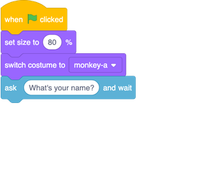
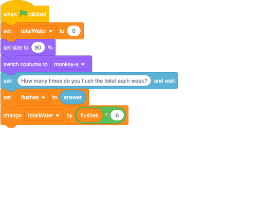
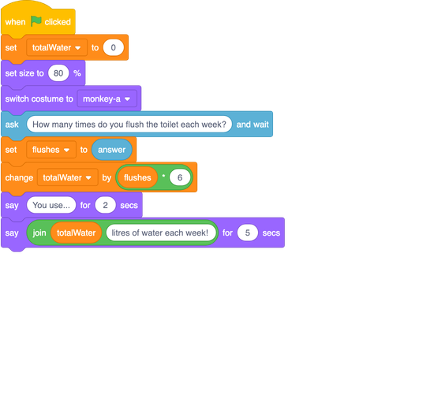
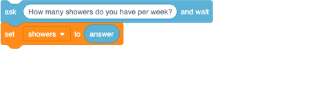
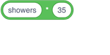
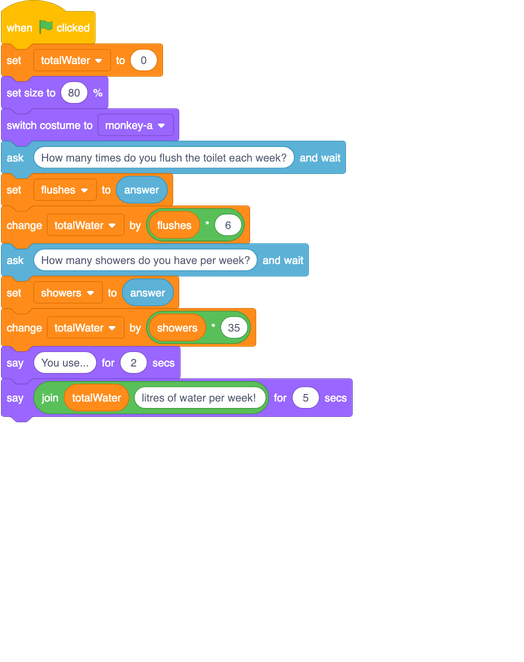
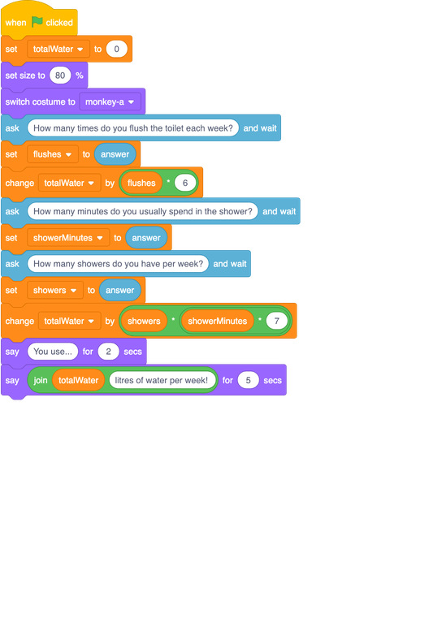

## Getting information from the user

On this card you'll make the water usage calculator. To personalise the calculation for your program's user, you'll use a new block to ask them questions that they can type in answers to.

+ Open a new Scratch project and go to the Costumes tab for the cat sprite.

+ Add a new costume from the library. Choose a character that will do some talking. I'm using this monkey:

+ Click on the Scripts tab and add the following blocks to your sprite. You will find the `ask and wait`{:class="block3sensing"} block in the **Sensing** category.

+ Change the question to `How many times do you flush the toilet each week?`.

You've asked the user for information — now you need to get the answer! 

+ First, create a variable called `flushes`{:class="block3variables"}. You will use it to store the user's answer.

[[[generic-scratch3-add-variable]]]

+ Drag out the `set flushes to`{:class="block3variables"} block from **Variables**.

+ Then, look in the **Sensing** section and find the `answer`{:class="block3sensing"} block. This is a special variable where a Scratch program puts the most recent answer it's received from an `ask and wait`{:class="block3sensing"} block.

+ Plug the block into your code like this:

Time for a bit of math! First you need somewhere to store a total.

+ Create another variable called `totalWater`{:class="block3variables"} and set its value to `0` at the start of the program.

+ Go to **Operators** and look for this block:

It lets you **multiply** two numbers.

+ Drag it into a `change totalWater by`{:class="block3variables"} block, like this:

+ Plug your `flushes`{:class="block3variables"} block into one side of the operator block and on the other side, type in the number `6`. 6 litres is roughly how much water is used for one toilet flush.

+ Finish off the script with a couple of `say`{:class="block3looks"} blocks to tell the user the result! You'll find the `join`{:class="block3operators"} block in **Operators**.

+ Click the green flag to test your code.

--- challenge ---

## Challenge: add more water uses to the calculation

+ Add another question to find out how many showers the person has per week. Then calculate how many litres of water this uses and add it to the total. 

A shower uses about 7 litres per minute, so a five-minute shower uses around 35 litres.

--- hints ---

--- hint ---

+ You'll need to create a variable to store the number of showers per week. 

+ Use the `ask and wait`{:class="block3sensing"} and `answer`{:class="block3sensing"} blocks to get the information from the user and store it in the new variable.

--- /hint ---

--- hint ---

+ To calculate the amount of water used on showering, you'll need to multiply the number of showers by `35` (the amount of water for one five-minute shower).

+ You can add the result to your total like this:

--- /hint ---

--- hint ---

Your code should look something like this now:

--- /hint ---

--- hint ---

If you want to, you can also ask them how many minutes they spend in the shower! In that case, you would need to do an extra calculation: multiply the number of minutes by `7` (litres per minute in the shower), and then multiply the result by the number of showers. You can put an operator inside an operator to do that, like this:

Here's how your code would look:

--- /hint ---

--- /hints ---

--- /challenge ---
