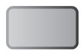
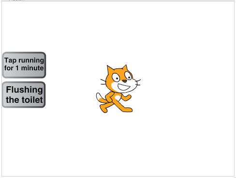
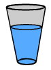
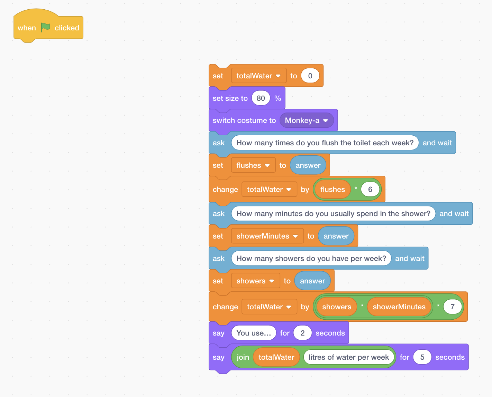

## Draw a chart

+ Make two new sprites called `Tap` and `Toilet`. Select this costume for both (it's in **Things**):



[[[generic-scratch-rename-sprite]]]

+ You'll need to draw on the costumes to add descriptive text to them. The `Tap` will be "Tap running for 1 minute" and the `Toilet` is "Flushing the toilet". To add text to your costume you can click on the **T** icon.


+ Place the two sprites one above the other on the left hand side of the stage.



+ Add another costume to your cat sprite, choosing the glass of water from the library.



+ Then add the following blocks to the end of your code:

```blocks
    say [How about brushing your teeth?] for (2) secs
    say [It can be tempting to leave the tap running while you brush. But did you know...] for (4) secs
    say [...a running tap loses 6 litres of water per minute?] for (3) secs
    switch costume to [glass water-a v]
    set size to (35) %
```

+ Click the green flag to test your program.

--- collapse ---
---
title: Do I have to wait for the old code to run all the time?
---

If, like me, you don't want to go through the **whole** program every time you want to test a new bit of code, then you can move it out of the way for the moment!

+ Detatch all the code from the previous card from the green flag block and drag it off to one side – but don't get rid of it entirely! Just leave it in a space on the current sprite panel.



+ Then attach your new code directly onto the green flag.

```blocks
    when green flag clicked
    say [How about brushing your teeth?] for (2) secs
    say [It can be tempting to leave the tap running while you brush. But did you know...] for (4) secs
    say [...a running tap loses 6 litres of water per minute?] for (3) secs
    switch costume to [glass water-a v]
    set size to (35) %
```

+ When you're ready, you can put everything back together again.


```blocks
    when green flag clicked
    set [totalWater v] to [0]
    set size to (80) %
    switch costume to [monkey2-a v]
    ask [How many times do you flush the toilet each week?] and wait
    set [flushes v] to (answer)
    change [totalWater v] by ((flushes) * (6))
    ask [How many minutes do you usually spend in the shower?] and wait
    set [showerMinutes v] to (answer)
    ask [How many showers do you have per week?] and wait
    set [showers v] to (answer)
    change [totalWater v] by ((showers) * ((showerMinutes) * (7)))
    say [You use...] for (2) secs
    say (join(totalWater) [ litres of water per week!]) for (5) secs
    say [How about brushing your teeth?] for (2) secs
    say [It can be tempting to leave the tap running while you brush. But did you know...] for (4) secs
    say [...a running tap loses 6 litres of water per minute?] for (3) secs
    switch costume to [glass water-a v]
    set size to (35) %
```

--- /collapse ---

+ Add the following blocks to the end of your script. You'll find the `stamp`{:class="blockpen"} block in the **pen** category.

```blocks
    go to [Tap v]
    move (45) steps
    repeat (6)
        move (20) steps
        stamp
        wait (0.5) secs
    end
```

+ Click the green flag to watch your new animation!

+ You might need to change the `move 45 steps`{:class="blockmotion"} to another number depending on the size of your `Tap` sprite. The purpose of this block is to place the glass **beside** the text so you can see it.

--- collapse ---
---
title: How does it work?
---

The `stamp`{:class="blockpen"} block makes a sprite stamp an image of itself onto the stage.

It draws the image straight onto the background, so no new sprites are created.

You can double click the `clear`{:class="blockpen"} block to remove everything that was added with **pen** blocks, or you can add it to your code to clear everything automatically in your program.

--- /collapse ---

+ Whenever you run your code again, you'll see that the stamped glasses are still there at the start. To clear them away, add the `clear`{:class="blockpen"} block to the top of your script, right after the green flag. You can reset the position of the sprite to the centre as well using a `go to`{:class="blockmotion"} block.

```blocks
    when green flag clicked
    clear
    go to x:(0) y:(0)
```

--- challenge ---

## Challenge: Add a graphic for flushing the toilet

+ Can you add similar code to make the sprite illustrate the amount of water that's used by flushing the toilet?

--- hints ---

--- hint ---

+ Use the `go to mouse-pointer`{:class="blockmotion"} block to move the sprite to the correct sprite, and select the sprite by clicking on the little triangle.

+ Repeat the stamp code `6` times, which is the number of litres of water used.

--- /hint ---

--- hint ---

+ Here is the code you need to add:

```blocks
    go to [Toilet v]
    move (45) steps
    repeat (6)
        move (20) steps
        stamp
        wait (0.5) secs
    end
```

--- /hint ---

--- /hints ---

--- /challenge ---