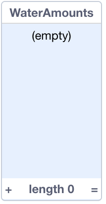
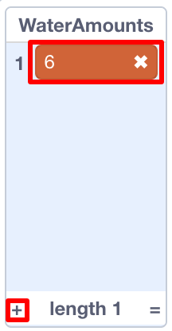
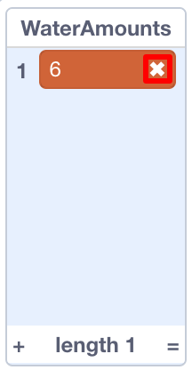

## Using a list

+ Go to the **data** blocks and click **Make a List**.

+ Enter `WaterAmounts` as the name and click **OK**.

Your list will appear on the stage.

+ Click the `+` at the bottom of the list and type in the number `6`. This is the number of litres for your first illustration, the running tap.

--- collapse ---
---
title: Removing an item
---

+ If you want to remove items from the list, you can.

+ Click on the item you want to delete, then click the little `x` that appears next to it.

--- /collapse ---

+ Add another item for your second illustration, flushing the toilet. The value for this one is `6` as well.

+ You can untick the checkbox next to your list in the **data** blocks to hide it from the stage.
