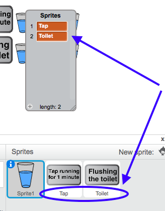

## Matching things up

+ Make another list, called `Sprites`.

+ Add two items to the list: `Tap` and `Toilet`. Make sure that what you type is exactly the same as the names of the Tap and Toilet sprites!



+ Now look at your script with the loops and find the two `go to`{:class="blockmotion"} blocks that make the talking sprite move to the Tap and the Toilet sprites.

+ Just like you did before, drag an `item`{:class="blockdata"} block into each one – it doesn't look like you can place something else into the box but you can! Give it a try.

```blocks
    go to (item (1 v) of [Sprites v])
```

+ Your code should look like this now:

```blocks
    go to (item (1 v) of [Sprites v])
    move (45) steps
    repeat (item (1 v) of [WaterAmounts v])
        move (20) steps
        stamp
        wait (0.5) secs
    end
    go to (item (2 v) of [Sprites v])
    move (45) steps
    repeat (item (2 v) of [WaterAmounts v])
        move (20) steps
        stamp
        wait (0.5) secs
    end
```
