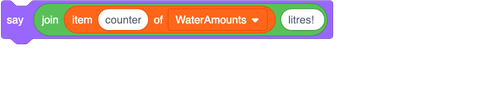
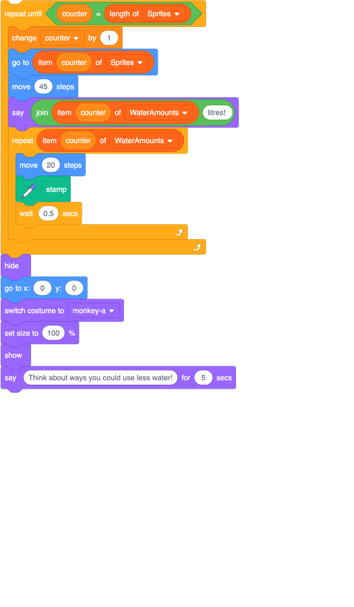
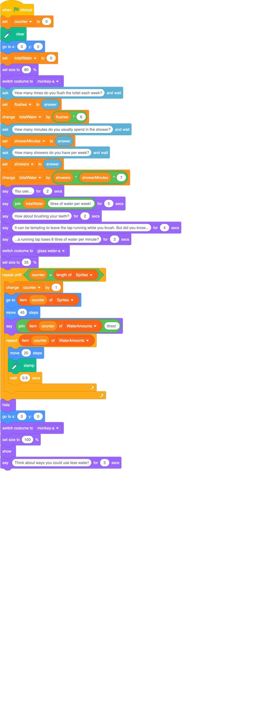

## Final tweaks

On this card you'll make a few small changes to control things like the speed of the animation. Customise the changes to suit your own program!

+ Change the number of steps after the `stamp`{:class="block3extensions"} from `20` to `4`. You'll probably need make the first `move`{:class="block3motion"} bigger, maybe `60` instead of `45`, to get the glass of water out from behind the text sprite again.

+ Move the `wait`{:class="block3control"} out of the first loop and put it after the loop instead, but still inside the `repeat until`{:class="block3control"} loop, and change the value to `1` or `2` seconds, or whatever you like.

+ Test it out, and tweak the numbers to suit you!

+ Finally, why not add a `say`{:class="block3looks"} block to have the sprite display the number of litres of water being shown? 

+ I'm also adding in some code at the very end to change the sprite back to the monkey and get the user to think about ways to conserve water.

--- collapse ---
---
title: Show me all the code!
---

Here is how the whole program looks now, do you can check it if something in yours is not working right:

--- /collapse ---

